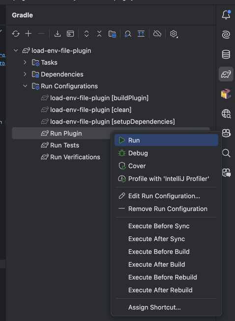

# load-env-file-plugin


[](https://plugins.jetbrains.com/plugin/MARKETPLACE_ID)
[](https://plugins.jetbrains.com/plugin/MARKETPLACE_ID)

# Usage
<!-- Plugin description -->
This plugin provides support for `.env` file in the project root.
`.env` file loads when the project is opened, and the run configuration is saved.

When you add a Run Configuration, the contents of the .env file are automatically set as the Run Configuration's environment variables.

Current supported features:
- Gradle
- Kotlin
<!-- Plugin description end -->

# Manual Installation

```shell
./gradlew buildPlugin
```

You can find the plugin zip file in `build/distributions` directory.
Install the plugin from disk in Jetbrains IDE.

# Development

You can run the plugin in the sandbox environment by running the following image.
Off course, you can use debug mode.


